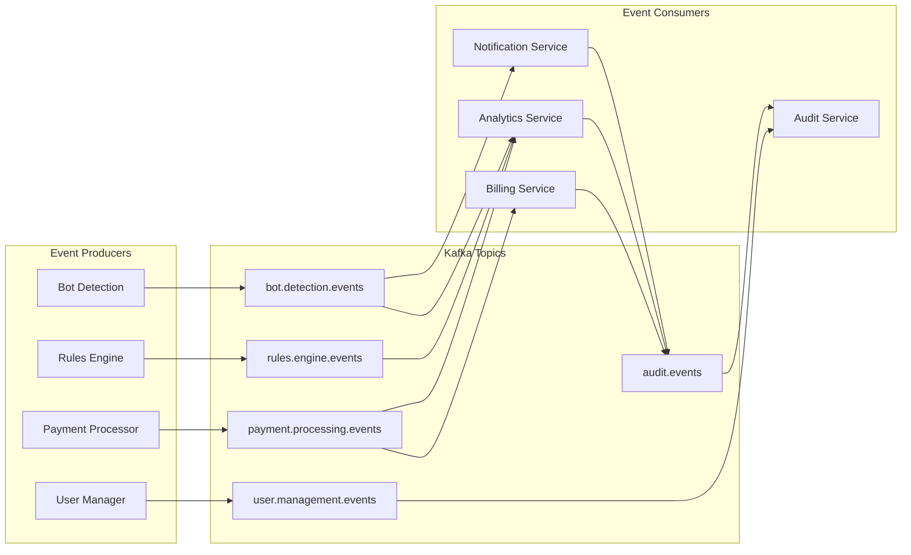

# Arbiter Platform Transformation - Design Document

## Overview

The Arbiter Platform represents a fundamental architectural transformation from a WordPress plugin to a cloud-native, enterprise-grade platform for AI content monetization. The design leverages modern microservices architecture, event-driven patterns, and polyglot persistence to create a scalable, secure, and globally distributed system.

The platform serves as a two-sided marketplace with sophisticated business logic, real-time analytics, and automated enforcement capabilities. It's designed to handle billions of micro-transactions while maintaining sub-200ms response times globally.

## Architecture

### High-Level Architecture

```mermaid
graph TB
    subgraph "Client Layer"
        WEB[Web Dashboard]
        MOBILE[Mobile Apps]
        SDK[Publisher SDKs]
        API_CLIENTS[AI Company APIs]
    end
    
    subgraph "Edge Layer"
        CDN[Cloudflare CDN]
        WAF[Web Application Firewall]
        EDGE_CACHE[Edge Caching]
    end
    
    subgraph "API Gateway Layer"
        GATEWAY[API Gateway]
        AUTH[Authentication Service]
        RATE_LIMIT[Rate Limiting]
        LOAD_BALANCER[Load Balancer]
    end
    
    subgraph "Core Services"
        USER_SERVICE[User Management]
        PUBLISHER_SERVICE[Publisher Service]
        BOT_DETECTION[Bot Detection]
        RULES_ENGINE[Rules Engine]
        PRICING_ENGINE[Pricing Engine]
        LICENSING_SERVICE[Content Licensing]
        PAYMENT_SERVICE[Payment Processing]
        ANALYTICS_SERVICE[Analytics Service]
        NOTIFICATION_SERVICE[Notification Service]
    end
    
    subgraph "Data Layer"
        POSTGRES[(PostgreSQL)]
        REDIS[(Redis Cache)]
        ELASTICSEARCH[(Elasticsearch)]
        CLICKHOUSE[(ClickHouse)]
        OBJECT_STORAGE[(Cloud Storage)]
    end
    
    subgraph "Event Streaming"
        KAFKA[Apache Kafka]
        SCHEMA_REGISTRY[Schema Registry]
    end
    
    subgraph "External Integrations"
        STRIPE[Stripe Payments]
        CLOUDFLARE_API[Cloudflare API]
        AI_COMPANIES[AI Company APIs]
        CMS_PLUGINS[CMS Plugins]
    end
    
    WEB --> CDN
    MOBILE --> CDN
    SDK --> CDN
    API_CLIENTS --> CDN
    
    CDN --> GATEWAY
    WAF --> GATEWAY
    EDGE_CACHE --> GATEWAY
    
    GATEWAY --> AUTH
    GATEWAY --> RATE_LIMIT
    GATEWAY --> LOAD_BALANCER
    
    LOAD_BALANCER --> USER_SERVICE
    LOAD_BALANCER --> PUBLISHER_SERVICE
    LOAD_BALANCER --> BOT_DETECTION
    LOAD_BALANCER --> RULES_ENGINE
    LOAD_BALANCER --> PRICING_ENGINE
    LOAD_BALANCER --> LICENSING_SERVICE
    LOAD_BALANCER --> PAYMENT_SERVICE
    LOAD_BALANCER --> ANALYTICS_SERVICE
    LOAD_BALANCER --> NOTIFICATION_SERVICE
    
    USER_SERVICE --> POSTGRES
    PUBLISHER_SERVICE --> POSTGRES
    BOT_DETECTION --> REDIS
    RULES_ENGINE --> POSTGRES
    PRICING_ENGINE --> POSTGRES
    LICENSING_SERVICE --> POSTGRES
    PAYMENT_SERVICE --> POSTGRES
    ANALYTICS_SERVICE --> CLICKHOUSE
    NOTIFICATION_SERVICE --> REDIS
    
    USER_SERVICE --> KAFKA
    PUBLISHER_SERVICE --> KAFKA
    BOT_DETECTION --> KAFKA
    RULES_ENGINE --> KAFKA
    PRICING_ENGINE --> KAFKA
    LICENSING_SERVICE --> KAFKA
    PAYMENT_SERVICE --> KAFKA
    ANALYTICS_SERVICE --> KAFKA
    NOTIFICATION_SERVICE --> KAFKA
    
    PAYMENT_SERVICE --> STRIPE
    BOT_DETECTION --> CLOUDFLARE_API
    PUBLISHER_SERVICE --> CMS_PLUGINS
    LICENSING_SERVICE --> AI_COMPANIES
```



### Microservices Architecture

The platform follows Domain-Driven Design principles with bounded contexts mapped to individual microservices:

#### Core Domain Services
- **User Management Service**: Authentication, authorization, user profiles
- **Publisher Service**: Website management, domain verification, publisher analytics
- **Bot Detection Service**: AI-powered bot identification and classification
- **Rules Engine Service**: Dynamic rule creation, validation, and execution
- **Pricing Engine Service**: Dynamic pricing algorithms and optimization
- **Content Licensing Service**: License management, approval workflows
- **Payment Processing Service**: Transaction handling, revenue distribution
- **Analytics Service**: Real-time metrics, reporting, business intelligence
- **Notification Service**: Multi-channel notifications and alerts

#### Supporting Services
- **API Gateway**: Request routing, authentication, rate limiting
- **Configuration Service**: Centralized configuration management
- **Audit Service**: Comprehensive audit logging and compliance
- **Integration Service**: External API management and orchestration

### Communication Patterns

#### Synchronous Communication
- **Internal Services**: gRPC with Protocol Buffers for high-performance, type-safe communication
- **External APIs**: REST with OpenAPI 3.0 specification for public interfaces
- **Real-time Updates**: WebSocket connections for dashboard updates

#### Asynchronous Communication
- **Event Streaming**: Apache Kafka for reliable, ordered event processing
- **Message Queues**: Redis Pub/Sub for lightweight messaging
- **Webhooks**: HTTP callbacks for external system integration

### Event-Driven Architecture



## Components and Interfaces

### API Gateway Component

**Responsibilities:**
- Request routing and load balancing
- Authentication and authorization
- Rate limiting and throttling
- Request/response transformation
- API versioning and documentation

**Key Interfaces:**
```typescript
interface APIGatewayConfig {
  routes: RouteConfig[];
  authentication: AuthConfig;
  rateLimiting: RateLimitConfig;
  cors: CORSConfig;
}

interface RouteConfig {
  path: string;
  method: HTTPMethod;
  service: string;
  authentication: boolean;
  rateLimit: number;
  timeout: number;
}
```

### Bot Detection Service

**Responsibilities:**
- Real-time bot identification using ML models
- Bot behavior analysis and classification
- Integration with Cloudflare for edge enforcement
- Continuous model training and improvement

**Key Interfaces:**
```typescript
interface BotDetectionRequest {
  userAgent: string;
  ipAddress: string;
  headers: Record<string, string>;
  requestPattern: RequestPattern;
}

interface BotDetectionResponse {
  isBot: boolean;
  botType: BotType;
  confidence: number;
  riskScore: number;
  recommendedAction: Action;
}

interface BotClassification {
  category: 'search_engine' | 'ai_training' | 'scraper' | 'legitimate';
  vendor: string;
  purpose: string;
  trustLevel: TrustLevel;
}
```

### Rules Engine Service

**Responsibilities:**
- Dynamic rule creation and validation
- Rule execution and decision making
- Rule conflict resolution
- Performance optimization for rule evaluation

**Key Interfaces:**
```typescript
interface Rule {
  id: string;
  publisherId: string;
  conditions: Condition[];
  actions: Action[];
  priority: number;
  isActive: boolean;
  metadata: RuleMetadata;
}

interface Condition {
  field: string;
  operator: 'equals' | 'contains' | 'greater_than' | 'less_than' | 'in';
  value: any;
  logicalOperator?: 'AND' | 'OR';
}

interface RuleEvaluationContext {
  botType: string;
  contentType: string;
  publisherTier: string;
  requestTime: Date;
  geolocation: string;
}
```

### Pricing Engine Service

**Responsibilities:**
- Dynamic pricing calculation
- Market-based pricing optimization
- A/B testing for pricing strategies
- Revenue optimization algorithms

**Key Interfaces:**
```typescript
interface PricingRequest {
  publisherId: string;
  contentId: string;
  botType: string;
  usageType: UsageType;
  volume: number;
  context: PricingContext;
}

interface PricingResponse {
  basePrice: number;
  finalPrice: number;
  discounts: Discount[];
  currency: string;
  validUntil: Date;
  pricingStrategy: string;
}

interface PricingModel {
  type: 'fixed' | 'dynamic' | 'auction' | 'subscription';
  parameters: Record<string, any>;
  constraints: PricingConstraint[];
}
```

### Analytics Service

**Responsibilities:**
- Real-time metrics collection and processing
- Dashboard data aggregation
- Custom report generation
- Predictive analytics and forecasting

**Key Interfaces:**
```typescript
interface AnalyticsEvent {
  eventType: string;
  timestamp: Date;
  userId: string;
  properties: Record<string, any>;
  sessionId?: string;
}

interface MetricQuery {
  metric: string;
  dimensions: string[];
  filters: Filter[];
  timeRange: TimeRange;
  granularity: 'minute' | 'hour' | 'day' | 'week' | 'month';
}

interface DashboardWidget {
  type: 'chart' | 'table' | 'metric' | 'map';
  query: MetricQuery;
  visualization: VisualizationConfig;
  refreshInterval: number;
}
```

## Data Models

### Core Entity Models

#### User and Publisher Models
```typescript
interface User {
  id: string;
  email: string;
  passwordHash: string;
  profile: UserProfile;
  roles: Role[];
  preferences: UserPreferences;
  createdAt: Date;
  updatedAt: Date;
  lastLoginAt: Date;
}

interface Publisher extends User {
  businessInfo: BusinessInfo;
  websites: Website[];
  paymentInfo: PaymentInfo;
  tier: 'free' | 'pro' | 'enterprise';
  monthlyRevenue: number;
  totalRevenue: number;
}

interface Website {
  id: string;
  publisherId: string;
  domain: string;
  isVerified: boolean;
  contentTypes: ContentType[];
  rules: Rule[];
  analytics: WebsiteAnalytics;
}
```

#### Bot and Detection Models
```typescript
interface Bot {
  id: string;
  name: string;
  userAgent: string;
  vendor: string;
  category: BotCategory;
  trustLevel: TrustLevel;
  detectionPatterns: DetectionPattern[];
  lastSeen: Date;
}

interface BotDetectionLog {
  id: string;
  timestamp: Date;
  ipAddress: string;
  userAgent: string;
  detectedBot: Bot;
  confidence: number;
  action: 'allow' | 'block' | 'challenge' | 'monetize';
  websiteId: string;
}
```

#### Licensing and Transaction Models
```typescript
interface License {
  id: string;
  publisherId: string;
  aiCompanyId: string;
  contentScope: ContentScope;
  terms: LicenseTerms;
  pricing: PricingModel;
  status: 'pending' | 'active' | 'suspended' | 'expired';
  usage: UsageMetrics;
  createdAt: Date;
  expiresAt: Date;
}

interface Transaction {
  id: string;
  licenseId: string;
  amount: number;
  currency: string;
  publisherShare: number;
  platformFee: number;
  status: 'pending' | 'completed' | 'failed' | 'refunded';
  metadata: TransactionMetadata;
  processedAt: Date;
}
```

### Database Schema Design

#### PostgreSQL Schema (Transactional Data)
```sql
-- Core user and publisher tables
CREATE TABLE users (
    id UUID PRIMARY KEY DEFAULT gen_random_uuid(),
    email VARCHAR(255) UNIQUE NOT NULL,
    password_hash VARCHAR(255) NOT NULL,
    profile JSONB NOT NULL DEFAULT '{}',
    roles TEXT[] NOT NULL DEFAULT '{}',
    preferences JSONB NOT NULL DEFAULT '{}',
    created_at TIMESTAMP WITH TIME ZONE DEFAULT NOW(),
    updated_at TIMESTAMP WITH TIME ZONE DEFAULT NOW(),
    last_login_at TIMESTAMP WITH TIME ZONE
);

CREATE TABLE publishers (
    id UUID PRIMARY KEY REFERENCES users(id),
    business_info JSONB NOT NULL DEFAULT '{}',
    payment_info JSONB NOT NULL DEFAULT '{}',
    tier VARCHAR(20) NOT NULL DEFAULT 'free',
    monthly_revenue DECIMAL(12,2) DEFAULT 0,
    total_revenue DECIMAL(12,2) DEFAULT 0
);

CREATE TABLE websites (
    id UUID PRIMARY KEY DEFAULT gen_random_uuid(),
    publisher_id UUID NOT NULL REFERENCES publishers(id),
    domain VARCHAR(255) NOT NULL,
    is_verified BOOLEAN DEFAULT FALSE,
    content_types TEXT[] NOT NULL DEFAULT '{}',
    created_at TIMESTAMP WITH TIME ZONE DEFAULT NOW(),
    UNIQUE(publisher_id, domain)
);

-- Rules and pricing tables
CREATE TABLE rules (
    id UUID PRIMARY KEY DEFAULT gen_random_uuid(),
    publisher_id UUID NOT NULL REFERENCES publishers(id),
    website_id UUID REFERENCES websites(id),
    name VARCHAR(255) NOT NULL,
    conditions JSONB NOT NULL,
    actions JSONB NOT NULL,
    priority INTEGER NOT NULL DEFAULT 0,
    is_active BOOLEAN DEFAULT TRUE,
    created_at TIMESTAMP WITH TIME ZONE DEFAULT NOW(),
    updated_at TIMESTAMP WITH TIME ZONE DEFAULT NOW()
);

-- Indexes for performance
CREATE INDEX idx_users_email ON users(email);
CREATE INDEX idx_websites_domain ON websites(domain);
CREATE INDEX idx_rules_publisher_priority ON rules(publisher_id, priority DESC);
CREATE INDEX idx_rules_conditions_gin ON rules USING GIN(conditions);
```

#### ClickHouse Schema (Analytics Data)
```sql
-- Analytics events table
CREATE TABLE analytics_events (
    event_id UUID,
    event_type String,
    timestamp DateTime64(3),
    user_id String,
    session_id String,
    properties Map(String, String),
    created_date Date MATERIALIZED toDate(timestamp)
) ENGINE = MergeTree()
PARTITION BY created_date
ORDER BY (event_type, timestamp, user_id);

-- Bot detection logs
CREATE TABLE bot_detection_logs (
    log_id UUID,
    timestamp DateTime64(3),
    ip_address IPv4,
    user_agent String,
    detected_bot String,
    confidence Float32,
    action String,
    website_id String,
    created_date Date MATERIALIZED toDate(timestamp)
) ENGINE = MergeTree()
PARTITION BY created_date
ORDER BY (timestamp, website_id);
```

## Error Handling

### Error Classification and Response Strategy

#### Error Categories
1. **Client Errors (4xx)**
   - Validation errors
   - Authentication failures
   - Authorization denials
   - Resource not found

2. **Server Errors (5xx)**
   - Service unavailable
   - Database connection failures
   - External service timeouts
   - Internal processing errors

3. **Business Logic Errors**
   - Rule conflicts
   - Pricing calculation failures
   - License violations
   - Payment processing errors

#### Error Response Format
```typescript
interface ErrorResponse {
  error: {
    code: string;
    message: string;
    details?: Record<string, any>;
    timestamp: string;
    requestId: string;
    retryable: boolean;
  };
}

// Example error responses
const ValidationError: ErrorResponse = {
  error: {
    code: 'VALIDATION_FAILED',
    message: 'Request validation failed',
    details: {
      field: 'email',
      reason: 'Invalid email format'
    },
    timestamp: '2024-01-15T10:30:00Z',
    requestId: 'req_123456789',
    retryable: false
  }
};
```

#### Circuit Breaker Pattern
```typescript
interface CircuitBreakerConfig {
  failureThreshold: number;
  recoveryTimeout: number;
  monitoringPeriod: number;
}

class CircuitBreaker {
  private state: 'CLOSED' | 'OPEN' | 'HALF_OPEN' = 'CLOSED';
  private failureCount = 0;
  private lastFailureTime?: Date;
  
  async execute<T>(operation: () => Promise<T>): Promise<T> {
    if (this.state === 'OPEN') {
      if (this.shouldAttemptReset()) {
        this.state = 'HALF_OPEN';
      } else {
        throw new Error('Circuit breaker is OPEN');
      }
    }
    
    try {
      const result = await operation();
      this.onSuccess();
      return result;
    } catch (error) {
      this.onFailure();
      throw error;
    }
  }
}
```

### Retry and Resilience Patterns

#### Exponential Backoff
```typescript
interface RetryConfig {
  maxAttempts: number;
  baseDelay: number;
  maxDelay: number;
  backoffMultiplier: number;
}

async function retryWithBackoff<T>(
  operation: () => Promise<T>,
  config: RetryConfig
): Promise<T> {
  let attempt = 1;
  let delay = config.baseDelay;
  
  while (attempt <= config.maxAttempts) {
    try {
      return await operation();
    } catch (error) {
      if (attempt === config.maxAttempts || !isRetryableError(error)) {
        throw error;
      }
      
      await sleep(Math.min(delay, config.maxDelay));
      delay *= config.backoffMultiplier;
      attempt++;
    }
  }
  
  throw new Error('Max retry attempts exceeded');
}
```

## Testing Strategy

### Testing Pyramid

#### Unit Tests (70% of test coverage)
- Individual service logic testing
- Data model validation
- Algorithm correctness
- Edge case handling

```typescript
// Example unit test for pricing engine
describe('PricingEngine', () => {
  it('should calculate dynamic pricing based on demand', () => {
    const pricingEngine = new PricingEngine();
    const request: PricingRequest = {
      publisherId: 'pub_123',
      contentId: 'content_456',
      botType: 'ai_training',
      usageType: 'bulk_access',
      volume: 1000,
      context: { demand: 'high', competition: 'medium' }
    };
    
    const result = pricingEngine.calculatePrice(request);
    
    expect(result.finalPrice).toBeGreaterThan(result.basePrice);
    expect(result.pricingStrategy).toBe('demand_based');
  });
});
```

#### Integration Tests (20% of test coverage)
- Service-to-service communication
- Database integration
- External API integration
- Event processing workflows

```typescript
// Example integration test
describe('Bot Detection Integration', () => {
  it('should detect bot and trigger pricing calculation', async () => {
    const botRequest = createMockBotRequest();
    
    // Trigger bot detection
    const detectionResult = await botDetectionService.detectBot(botRequest);
    
    // Verify pricing calculation is triggered
    expect(detectionResult.isBot).toBe(true);
    expect(pricingService.calculatePrice).toHaveBeenCalledWith({
      botType: detectionResult.botType,
      // ... other parameters
    });
  });
});
```

#### End-to-End Tests (10% of test coverage)
- Complete user workflows
- Cross-service functionality
- Performance benchmarks
- Security validation

```typescript
// Example E2E test
describe('Publisher Onboarding Flow', () => {
  it('should complete full publisher registration and setup', async () => {
    // Register new publisher
    const publisher = await registerPublisher({
      email: 'test@example.com',
      businessName: 'Test Business'
    });
    
    // Verify website
    await verifyWebsite(publisher.id, 'example.com');
    
    // Create pricing rules
    await createPricingRule(publisher.id, {
      botType: 'ai_training',
      price: 0.01
    });
    
    // Simulate bot access and verify monetization
    const accessResult = await simulateBotAccess('example.com');
    expect(accessResult.monetized).toBe(true);
  });
});
```

### Performance Testing

#### Load Testing Scenarios
1. **Normal Load**: 1,000 requests/second
2. **Peak Load**: 10,000 requests/second
3. **Stress Test**: 50,000 requests/second
4. **Spike Test**: Sudden traffic increases

#### Performance Benchmarks
- API Response Time: < 200ms (95th percentile)
- Database Query Time: < 50ms (average)
- Bot Detection Time: < 10ms (average)
- Event Processing Latency: < 100ms (end-to-end)

### Security Testing

#### Security Test Categories
1. **Authentication Testing**
   - JWT token validation
   - Session management
   - Multi-factor authentication

2. **Authorization Testing**
   - Role-based access control
   - Resource-level permissions
   - API endpoint security

3. **Input Validation Testing**
   - SQL injection prevention
   - XSS protection
   - CSRF token validation

4. **Infrastructure Security**
   - Network security
   - Container security
   - Secrets management

This comprehensive design provides the foundation for transforming the current WordPress plugin into a scalable, enterprise-grade platform that can handle the complex requirements of AI content monetization at global scale.