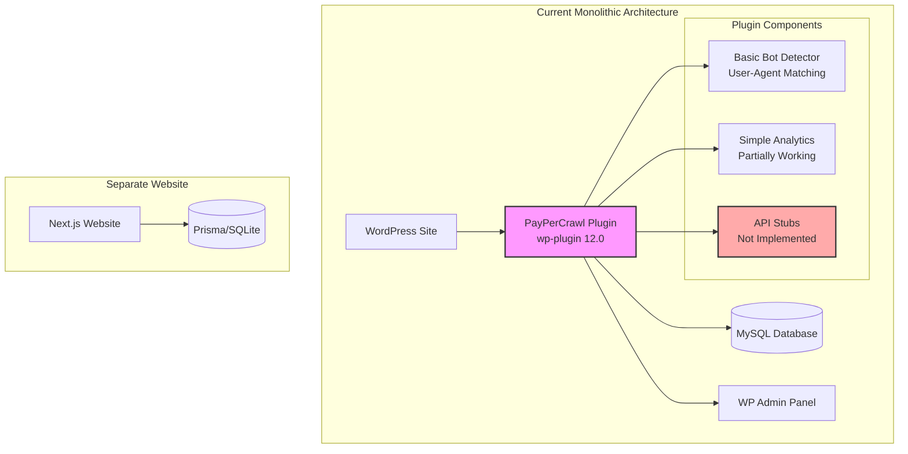
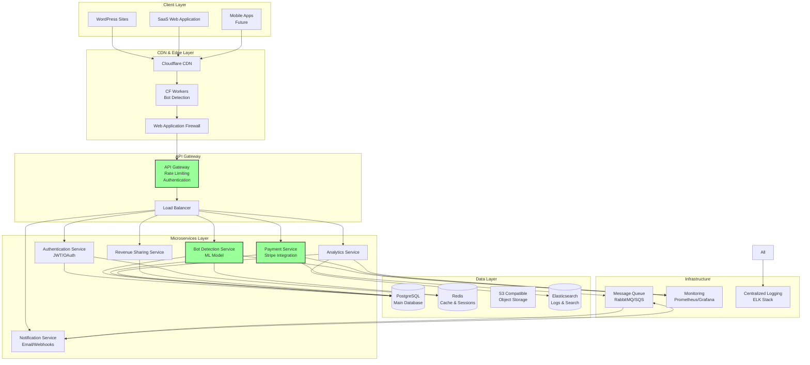
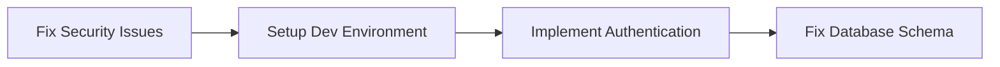
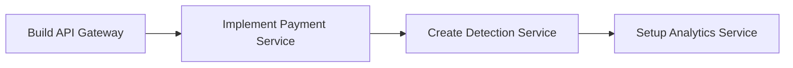
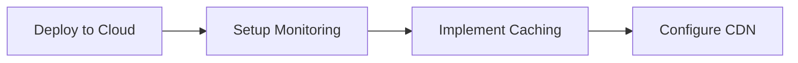
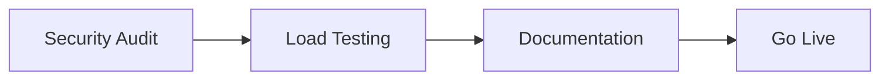

# Architecture Comparison: Current vs. Required
## PayPerCrawl Platform Architecture Analysis
### Date: December 7, 2024

---

## 🏗️ CURRENT ARCHITECTURE (AS-IS)



### Current Architecture Issues:
- ❌ Monolithic WordPress plugin
- ❌ No separation of concerns
- ❌ No API integration
- ❌ No payment processing
- ❌ No scalability
- ❌ Security vulnerabilities
- ❌ Disconnected website

---

## 🚀 REQUIRED ARCHITECTURE (TO-BE)



---

## 📊 COMPONENT COMPARISON TABLE

| Component | Current State | Required State | Gap Analysis |
|-----------|--------------|----------------|--------------|
| **Frontend** | WordPress Plugin Only | Multi-platform (WP, Web, Mobile) | Need web app, mobile apps |
| **Authentication** | None | JWT/OAuth2 | Complete implementation needed |
| **Bot Detection** | Basic UA matching | ML-based with 95%+ accuracy | ML model required |
| **Payment Processing** | None | Stripe with subscriptions | Full integration needed |
| **Database** | MySQL (basic schema) | PostgreSQL + Redis + S3 | Migration required |
| **API** | Stub functions | RESTful + GraphQL | Complete rebuild |
| **Caching** | None | Redis + CDN | Implementation needed |
| **Monitoring** | None | Prometheus + Grafana | Setup required |
| **Logging** | Basic error_log | ELK Stack | Centralized logging needed |
| **Security** | Multiple vulnerabilities | WAF + Rate Limiting + Encryption | Major overhaul |
| **Scalability** | None (monolithic) | Horizontal scaling with K8s | Containerization needed |
| **High Availability** | None | Multi-region with failover | Infrastructure needed |

---

## 🔄 MIGRATION PATH

### Phase 1: Foundation (Weeks 1-2)


### Phase 2: Core Services (Weeks 3-4)


### Phase 3: Infrastructure (Weeks 5-6)


### Phase 4: Production (Weeks 7-8)


---

## 💰 INFRASTRUCTURE COST ESTIMATION

### Current Infrastructure Cost
- WordPress Hosting: ~$50/month
- Total: **$50/month**

### Required Infrastructure Cost (AWS/GCP)
| Service | Monthly Cost |
|---------|-------------|
| Compute (ECS/GKE) | $200-400 |
| Database (RDS/Cloud SQL) | $100-200 |
| Cache (ElastiCache/Memorystore) | $50-100 |
| CDN (CloudFront/Cloudflare) | $50-100 |
| Storage (S3/GCS) | $20-50 |
| Monitoring | $50-100 |
| Load Balancer | $25 |
| **Total Estimated** | **$495-975/month** |

---

## 🎯 KEY ARCHITECTURE DECISIONS

### 1. Microservices vs Monolith
**Decision:** Microservices
**Rationale:** 
- Independent scaling
- Technology flexibility
- Fault isolation
- Team independence

### 2. Database Choice
**Decision:** PostgreSQL + Redis
**Rationale:**
- ACID compliance for payments
- JSON support for flexible data
- Redis for high-speed caching
- Proven scalability

### 3. Container Orchestration
**Decision:** Kubernetes
**Rationale:**
- Industry standard
- Auto-scaling
- Self-healing
- Multi-cloud support

### 4. API Design
**Decision:** REST + GraphQL
**Rationale:**
- REST for simple CRUD
- GraphQL for complex queries
- Better client flexibility
- Reduced over-fetching

---

## 📈 SCALABILITY METRICS

### Current Capacity
- Concurrent Users: ~100
- Requests/sec: ~10
- Data Storage: ~1GB
- Availability: ~95%

### Required Capacity
- Concurrent Users: 10,000+
- Requests/sec: 1,000+
- Data Storage: 100GB+
- Availability: 99.9%

---

## 🔒 SECURITY IMPROVEMENTS

### Current Security Posture
```
[========================================] 20%
Critical vulnerabilities, no encryption, no WAF
```

### Required Security Posture
```
[========================================] 95%
WAF, encryption, rate limiting, security monitoring
```

---

## 📝 ARCHITECTURE PRINCIPLES

### SOLID Principles
- **S**ingle Responsibility
- **O**pen/Closed
- **L**iskov Substitution
- **I**nterface Segregation
- **D**ependency Inversion

### 12-Factor App Methodology
1. ✅ Codebase in version control
2. ✅ Explicitly declare dependencies
3. ✅ Store config in environment
4. ✅ Treat backing services as attached resources
5. ✅ Strictly separate build and run stages
6. ✅ Execute app as stateless processes
7. ✅ Export services via port binding
8. ✅ Scale out via process model
9. ✅ Maximize robustness with fast startup
10. ✅ Keep development and production similar
11. ✅ Treat logs as event streams
12. ✅ Run admin tasks as one-off processes

---

## 🚀 NEXT STEPS

1. **Immediate** (This Week)
   - Fix critical security vulnerabilities
   - Setup development environment
   - Create project roadmap

2. **Short Term** (2-4 Weeks)
   - Implement core services
   - Setup CI/CD pipeline
   - Begin migration to microservices

3. **Medium Term** (1-2 Months)
   - Complete infrastructure setup
   - Implement monitoring
   - Performance optimization

4. **Long Term** (3+ Months)
   - Scale to production
   - Add advanced features
   - International expansion

---

**Architecture Review By:** CrawlGuard Technical Team
**Date:** December 7, 2024
**Next Review:** December 21, 2024
